# Capture Tracker Product Manual

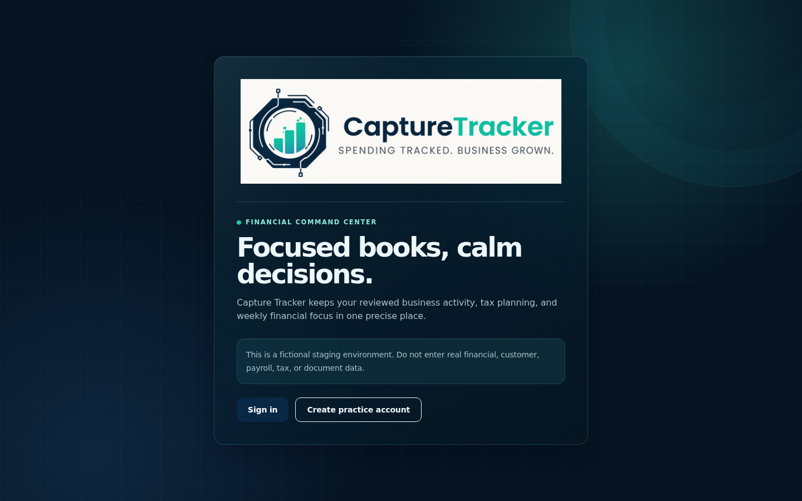

**SPENDING TRACKED. BUSINESS GROWN.**

| Manual detail | Value |
| --- | --- |
| Version | Private-pilot manual, 4 August 2026 |
| Source commit | `6f18f1017fa6ee3b0c17b19fa1a79cd6ac6972f2` |
| Audience | Invited Capture Tracker business owners |
| Client access | https://capture-tracker-production.mjorider.workers.dev |
| Screenshot environment | Fictional staging workspace: https://capture-tracker-staging.mjorider.workers.dev |

## 1. Welcome to Capture Tracker

Capture Tracker is a private workspace for recording business activity, reviewing it before it is relied on, organizing document evidence, and reading ledger-backed reports. The normal rhythm is simple: record or attach information, review the items that need a decision, then use Today, Reports, Taxes, and Weekly Review to stay oriented.

It is designed for a solo business owner who wants a clearer operating view of business cash, activity, documents, and open financial decisions. Today is a briefing; Money is the working transaction area; Reports are the accounting views. Capture Tracker supports those conversations, but does not replace a CPA, bookkeeper, attorney, payroll provider, or tax-filing service.

During the private pilot, expect invitation-only access, supported workflows only, and occasional product changes. Use the production URL for your own workspace. The screenshots in this manual use fictional staging data only.

## 2. Before You Begin

Use a current version of Safari, Chrome, Edge, or Firefox on a phone, tablet, or desktop. An internet connection is required. Keep your password private; never send it or an invitation code through a public channel.

Only upload documents you trust and are entitled to store. Documents are available only to authenticated users in the correct business workspace. Capture Tracker does **not** currently provide malware scanning or quarantine, so do not use it to test suspicious files or to accept documents from unknown senders.

## 3. Sign Up

1. Open the production URL above.
2. Select **Create account** when account creation is available.
3. Enter your name, email address, a password of at least 12 characters, and the private invitation code supplied by the owner.
4. Select **Create account**.
5. When the page confirms that the account is created or ready, select **Sign in** and sign in separately.
6. After a successful sign-in, Capture Tracker opens **Today**.

Invitation codes are private and can be rejected, removed, or unavailable when onboarding is closed. Do not send a code with a password. If the invitation is rejected or the Create account action is absent, contact the owner through the agreed private support channel.

The staging landing screen below is illustrative only; it intentionally says “Create practice account.” Production uses private-pilot wording and **Create account** when onboarding is enabled.

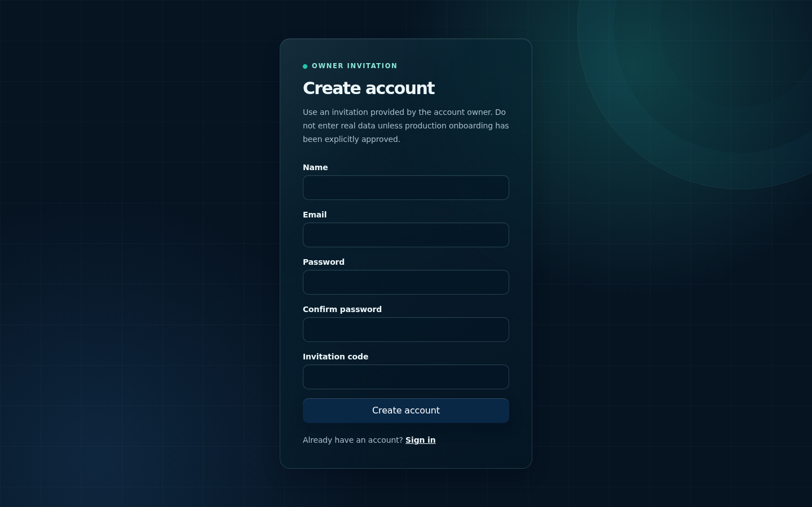

## 4. Sign In and Sign Out

1. Open the production URL and select **Sign in**.
2. Enter the email and password you created.
3. Select **Sign in**. A successful sign-in goes to **Today**.
4. Use **Sign out** in the top bar when you finish, especially on a shared device.

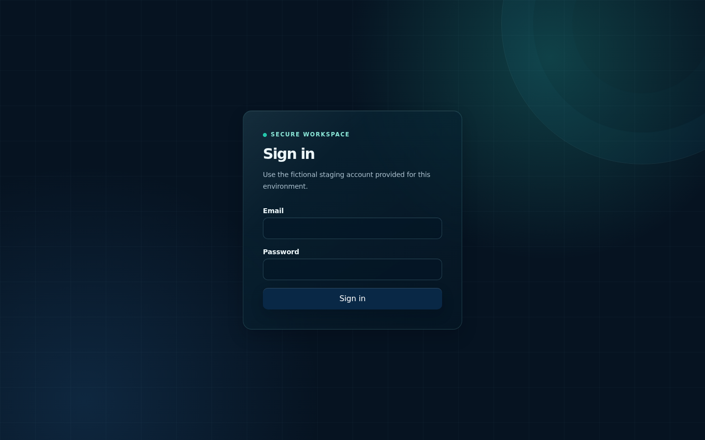

If sign-in fails, carefully re-enter the email and password. The current product displays a safe generic error rather than account details. It does not provide a self-service password-reset flow in the interface. If you cannot sign in, contact the owner; do not share a password while requesting help. Refreshing an open session is safe. If the session has expired, sign in again.

## 5. Save Capture Tracker on a Phone

Capture Tracker is used in a browser and may be saved to a device Home Screen. It is not an App Store or Play Store app.

### iPhone or iPad

1. Open the production URL in Safari.
2. Use Safari’s **Share** button.
3. Choose **Add to Home Screen**.
4. Confirm the app name and choose **Add**.
5. Open the new icon and sign in.

### Android

1. Open the production URL in Chrome.
2. Open Chrome’s menu.
3. Choose **Install app** or **Add to Home screen**.
4. Confirm the prompt, then open the icon and sign in.

Device and browser wording can vary. The icon still connects to the secure online service, so an internet connection and sign-in are required.

## 6. Navigation Overview

On desktop, the left sidebar shows the workspace destinations. On mobile, the bottom bar shows **Today**, **Money**, **Review**, **Reports**, and **More**. **More** opens Taxes, Documents, Ask AI, Activity, and Settings.

| Destination | Use it for | Primary action |
| --- | --- | --- |
| Today | Daily cash, planning, and attention briefing | Review transactions or open the next item |
| Money | Transactions, review, detail, and reconciliation | Add transaction |
| Taxes | Tax facts, estimates, payroll, owner compensation | Review an estimate or record an external payment |
| Documents | Private document evidence and review | Upload a private document |
| Review | Weekly Review task queue | Start or complete the week’s review |
| Reports | Profit and Loss, Balance Sheet, Trial Balance, Cash Activity | Apply a period or export CSV |
| Ask AI | Read-only questions about available facts | Ask a supported question |
| Activity | Read-only workspace history | Filter or open a related record |
| Settings | Supported business preferences | Save settings |

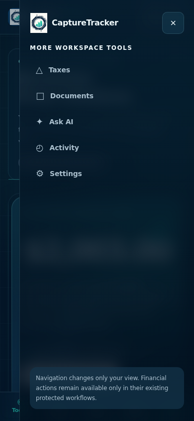

## 7. Today

Today is a daily briefing, not the complete ledger. It shows **Available business cash**, current-period income and expenses, tax and planning position, unreviewed transactions, document attention, Weekly Review status, and the decision queue. Available business cash is limited to the account activity included by the workspace; it is not a guarantee of money available for every purpose.

Start here each day: read the attention queue, select **Review transactions** when items are awaiting review, and follow related links for documents, taxes, or Weekly Review. If the account is new, Today explains how to add the first transaction.

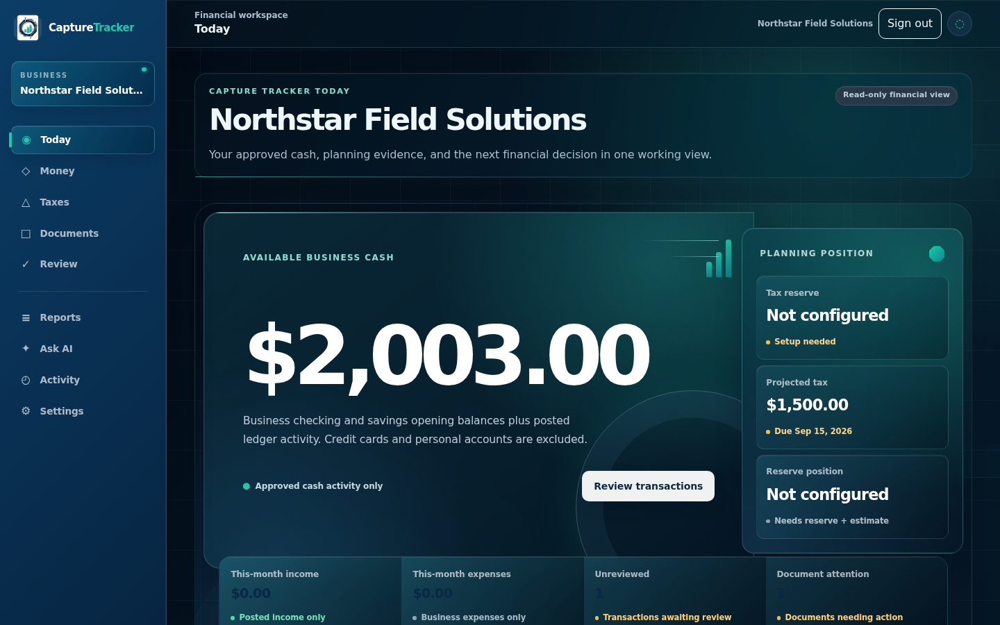

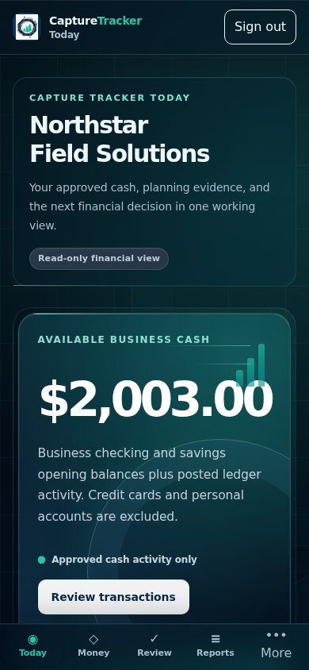

## 8. Money: Record, Review, Correct, and Reverse Activity

Money is the transaction workspace. Search by description, merchant, or reference; filter by status, intent, or financial account. The list identifies whether a document is linked and whether an item is pending review, approved, excluded, corrected, or voided.

### Add a transaction

1. Select **Money** and **Add transaction**.
2. Choose **Income / deposit**, **Business expense**, **Personal activity**, or **Mixed business / personal**.
3. Enter the date, exact amount, description, cash account, and the requested category or cash direction.
4. For a mixed item, enter business and personal portions that add exactly to the total.
5. Optionally add a merchant, reference, or note, then select **Save transaction**.

Income and business expenses use a category. Personal activity is for owner contribution or distribution activity; distributions are not deductible business expenses. A mixed transaction preserves its exact business and personal portions.

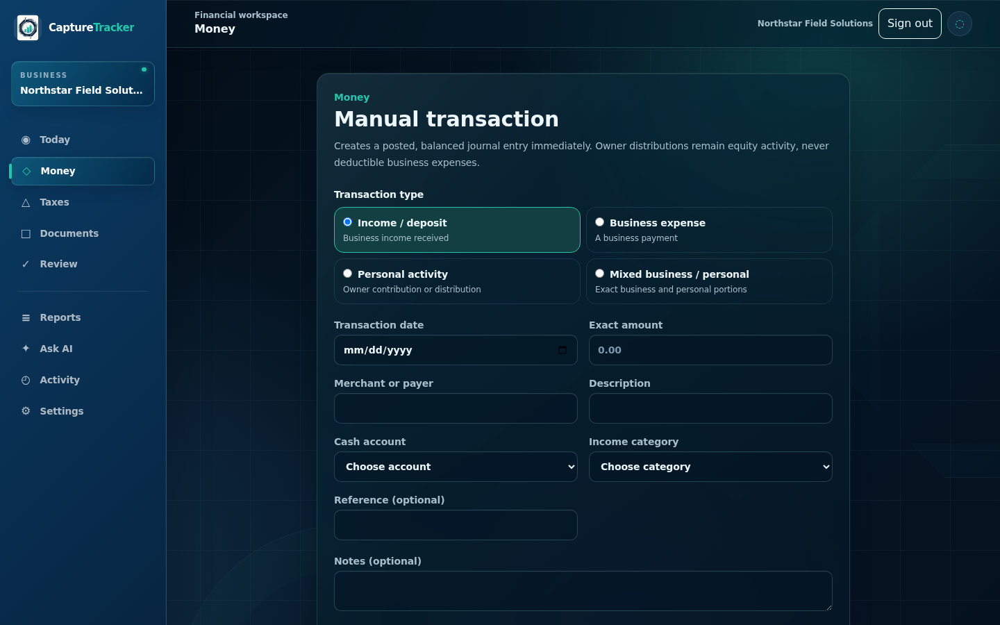

### Review, classify, and attach evidence

Open a transaction from the list. The detail page shows its amount, date, account, review choices, journal context, relationships, and linked evidence. Use the review controls to mark the item as business, personal, or mixed when available. Use **Documents** on the detail page to attach an eligible document or open a linked document. Linking evidence does not change the transaction or accounting data.

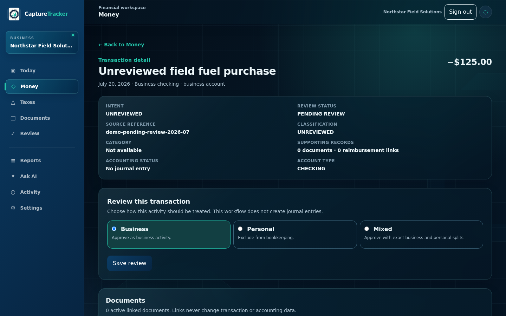

### Correct or reverse a posted item

Use the detail page’s available correction or reversal control only when the record permits it. A correction preserves the original history and creates the appropriate replacement relationship. A reversal creates an equal-and-opposite accounting record; it does not delete the original. Corrected, reversed, voided, and replacement relationships remain visible in history. If a control is unavailable, the item is already protected by its current state.

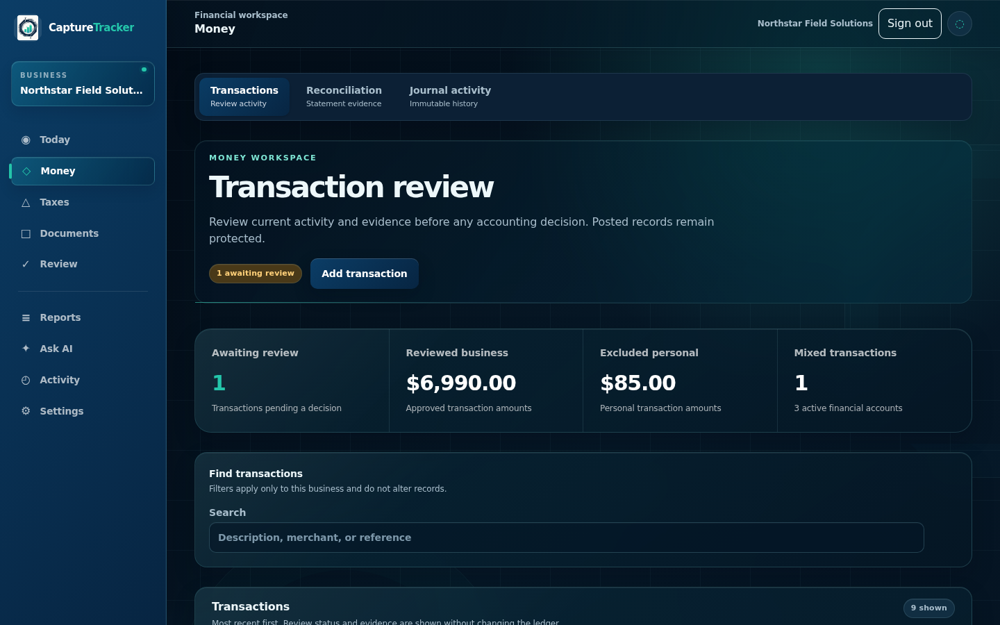

On mobile, transaction cards preserve the same review and evidence information; filters collapse to save space.

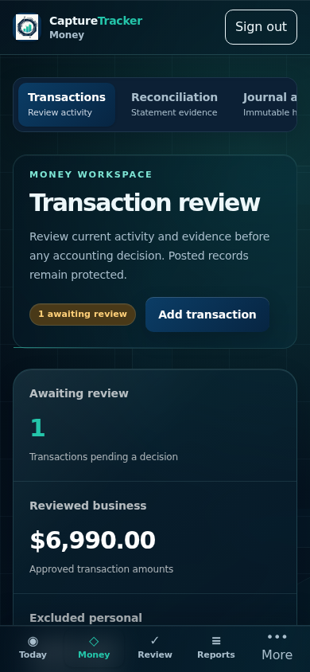

## 9. Documents

Documents holds private business evidence. The upload form accepts PDF, JPEG, and PNG files. Select **Upload document**, choose a trusted file, enter the requested document information, and select **Upload securely**. A duplicate is retained as the existing canonical document instead of creating another record.

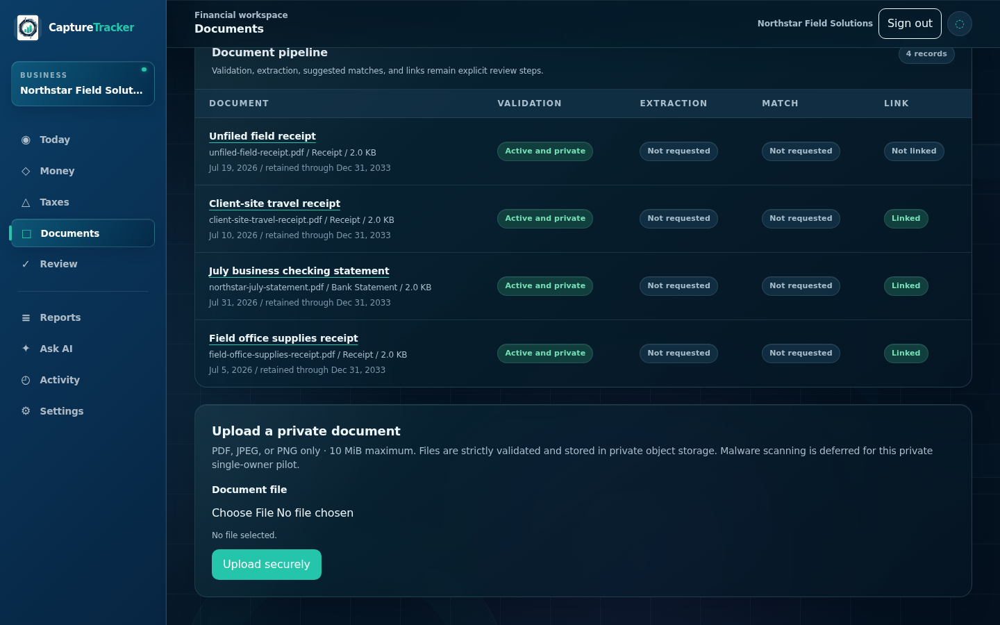

Open a document to see its status, metadata, safeguards, extraction evidence when present, and linked transactions. Use the available actions to link or unlink a transaction, review an extracted field, or review a suggested match. Accept an accurate extracted value, correct it when the visible evidence requires a different value, or reject it when it is not reliable. Suggested matches require an explicit approve or reject decision.

Use **Open securely** only for a document you are authorized to view. Public or external upload links are not available during the private pilot. Do not upload suspicious material: malware scanning and quarantine are not implemented.

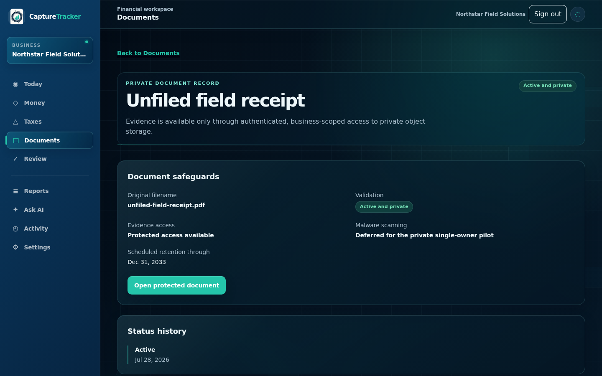

When Documents says attention is needed, open the item and resolve the shown validation, extraction, link, or review step. An empty workspace explains how to add the first trusted PDF, JPEG, or PNG.

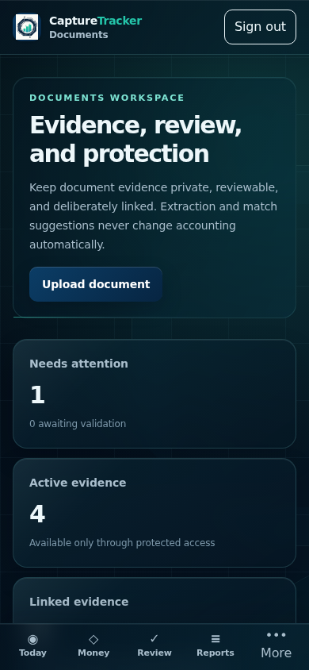

## 10. Taxes

Taxes is a planning and review workspace. It presents ledger-derived income, recorded salary expense, payroll facts, owner distributions, estimates, recorded payments, and missing-input messages for the selected year and quarter. It does not calculate a guaranteed tax outcome.

Use **Estimate history** to review an estimate and its payment history. When you paid outside Capture Tracker, open the applicable estimate and use **Record external payment** to enter the date, amount, optional confirmation number, and optional note. This records the fact; it does not submit a payment.

Use **Payroll summary** to review recorded payroll runs, and **Owner compensation** to compare factual salary and distribution signals. The guidance is for review with a qualified professional; Capture Tracker does not determine an IRS-approved salary, process payroll, file returns, or submit tax payments.

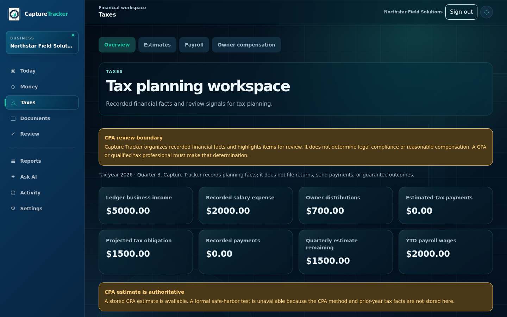

## 11. Weekly Review

The implemented tab label is **Review**; its page is titled **Weekly Review**. It groups unresolved tasks from transactions, categories, mixed splits, documents, reconciliation, and tax attention. Select a task to open its underlying record and resolve the real issue there.

1. Open **Review**.
2. Select **Start this week’s review** if no review is open.
3. Work through each group and open the linked record.
4. When ready, add an optional note and select **Complete review**.
5. Review the completion history if needed.

Completing a review records an acknowledgement and its task count. It never hides or changes unresolved underlying records. Reopen is available for a completed review.

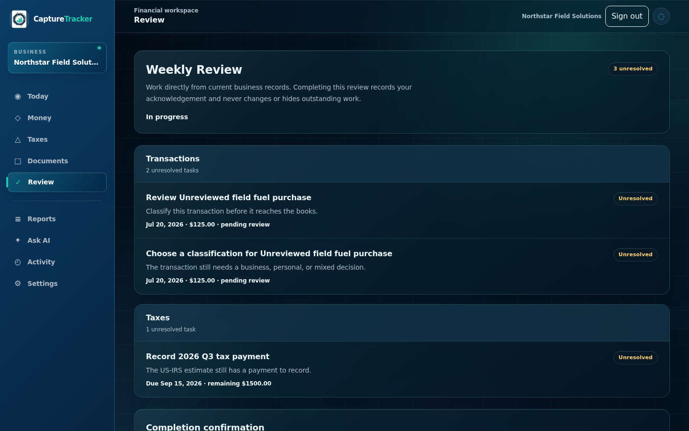

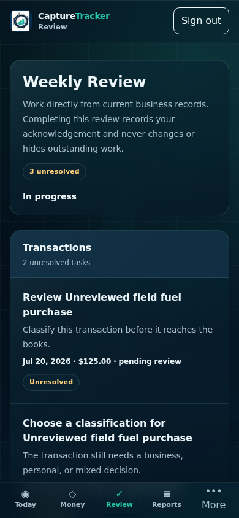

## 12. Reconciliation

Open **Money**, then **Reconciliation**, and choose the listed reconciliation. The page identifies the financial account, period, beginning and ending balances, difference, statement activity, candidate matches, and current selection.

1. Review unmatched statement activity.
2. Open an eligible candidate and choose **Approve match** or **Reject candidate** when those controls are offered.
3. Leave an item unmatched if no candidate is correct.
4. Use **Remove match** only when an existing match is wrong and the reconciliation is still editable.
5. Save the selected book activity.
6. Select **Finalize only at exact $0.00 difference** only after the difference is exactly zero.

Finalized reconciliations are immutable evidence. Matching or unmatching does not create an additional journal entry or duplicate a financial effect.

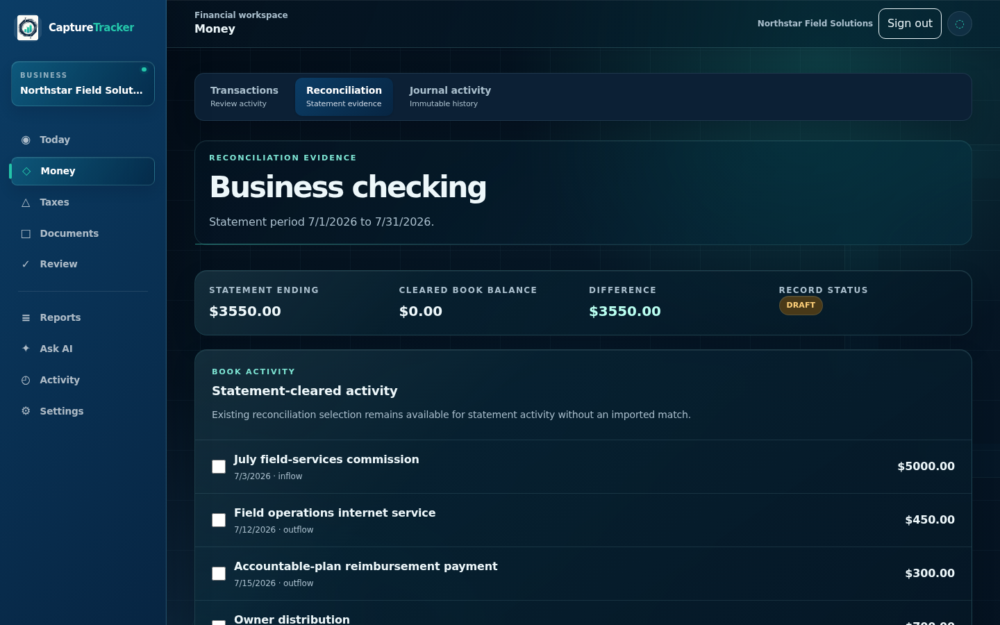

## 13. Reports and CSV Exports

Open **Reports**, choose a period, and select **Apply period**. Use the tabs for:

- **Profit and Loss**: income and business expenses for the selected period. Personal activity is excluded. Corrections and reversals remain reflected through preserved accounting history.
- **Balance Sheet**: assets, liabilities, and equity, including owner contributions and distributions.
- **Trial Balance**: debit and credit balances. Totals should match; use the available drill-through links for evidence.
- **Cash Activity**: opening cash, inflows, outflows, net change, and ending cash. Review it alongside reconciliation.

Select **Export CSV** when available to download the shown report data for a spreadsheet or CPA discussion. Do not edit a CSV and expect it to reimport; reimport is not a supported feature.

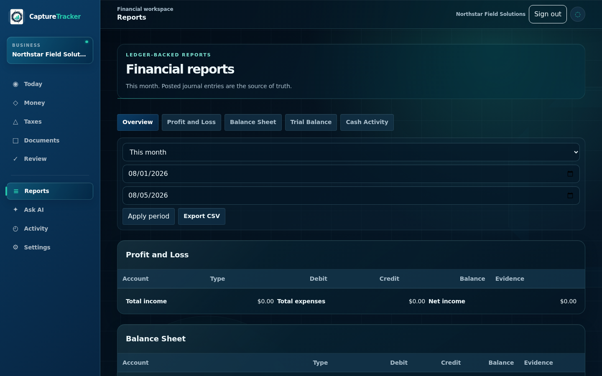

## 14. Ask AI

Ask AI is a read-only guide to the business facts available to Capture Tracker. Start a **New** conversation, enter a question, and review the answer and evidence links. Use the helpful/not-helpful feedback controls when they appear. A missing-data response means the needed facts are not available or supported.

Useful questions include: “What is my current cash position?”, “How much income did I receive this month?”, “What transactions still need review?”, “What documents need attention?”, “Explain my Profit and Loss,” “Is my Trial Balance balanced?”, “What statement activity is unmatched?”, and “How do salary and distributions compare?”

Ask AI cannot create or edit transactions, classify items, approve matches, finalize reconciliation, record payments, change settings, or replace tax, accounting, legal, or payroll advice.

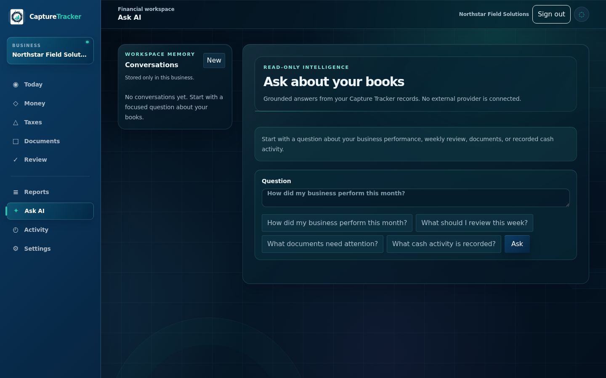

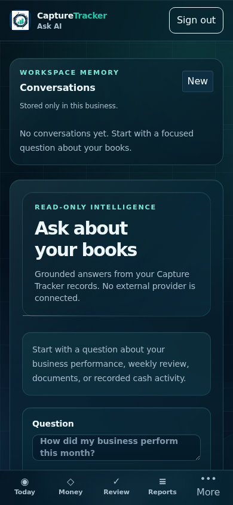

## 15. Activity and Settings

**Activity** is the read-only, business-scoped history of material workspace actions. Filter by module, search, date, and order; use **Open record** where offered. It includes transaction, correction, reversal, document, reconciliation, tax-payment, Weekly Review, setting, and export history. You cannot edit or delete Activity through the normal interface.

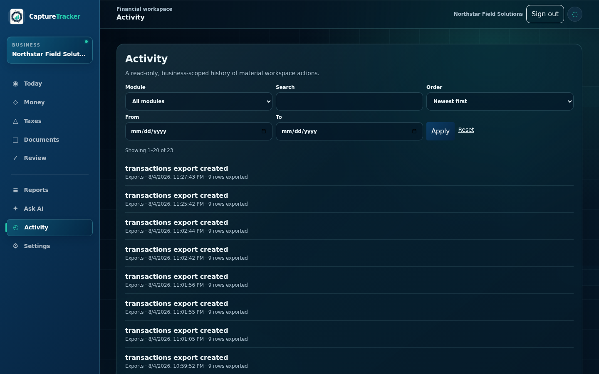

**Settings** currently exposes only these supported preferences: **Default report period**, **Weekly Review day (0–6)**, and **Document retention target (months, 12–120)**. Review the values, select **Save settings**, and watch for the success or stale-update message. Settings changes are recorded in Activity. Sign out remains in the top bar.

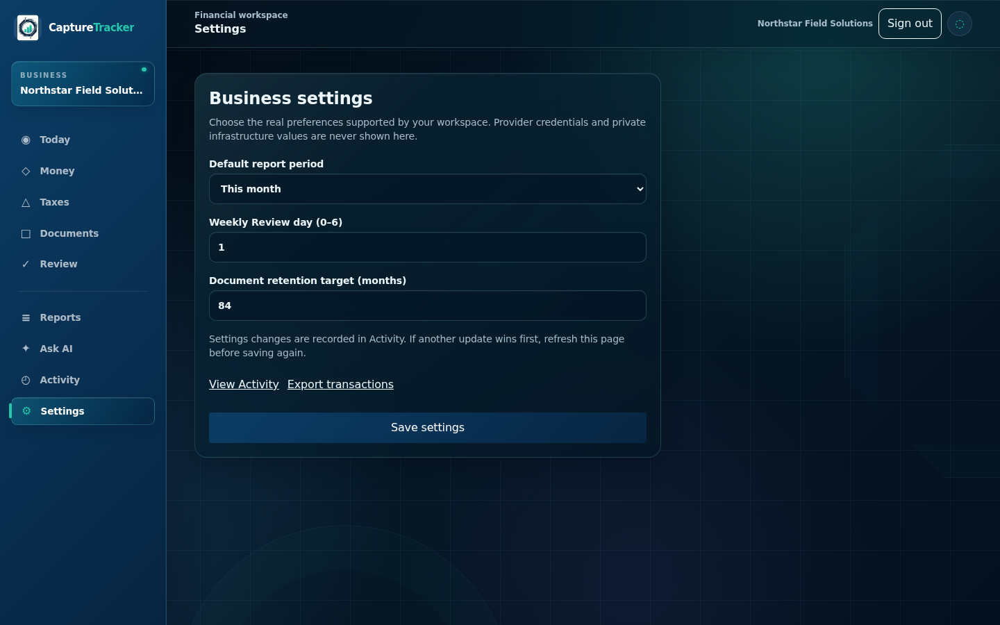

## 16. Common End-to-End Routines

### Record a business purchase

Add a **Business expense**, choose its expense category, save it, upload a trusted receipt in Documents, attach the receipt from the transaction or document detail, then review the transaction. Confirm the result in Money and the relevant report.

### Record business income

Add **Income / deposit**, enter the payer or description, date, amount, cash account, and income category, then save and review it. Check Today and Profit and Loss after the transaction is included.

### Record a mixed expense

Choose **Mixed business / personal**, enter the total and the exact business and personal portions, confirm the portions total the transaction exactly, select the appropriate category, and save. The personal portion is preserved as owner-equity activity rather than a deductible business expense.

### Correct a mistake or reverse a transaction

Open the item, read its current status, and use Correction or Reversal only when available. Verify the preserved original and resulting relationship in the detail, reports, and Activity. Never create a second manual copy merely to hide a mistake.

### Prepare for a CPA meeting

Review Reports and Taxes, export the needed CSVs, check Documents for missing evidence, look at Weekly Review, and use Activity to understand recorded changes. Bring questions to your CPA; Capture Tracker is not a professional filing or advisory service.

## 17. First-Day and Empty States

A new workspace can have no transactions, documents, tax estimates, reconciliation, report activity, Weekly Review tasks, Ask AI evidence, or Activity history beyond setup. This is normal. A practical first-day order is:

1. Review Settings.
2. Add the first financial transaction.
3. Upload the first trusted receipt.
4. Review Today.
5. Open Reports.
6. Review Weekly Review.
7. Ask a simple read-only Ask AI question.

## 18. Troubleshooting

| Issue | Safe action | Contact support when |
| --- | --- | --- |
| Invitation rejected or signup unavailable | Check the owner-supplied code; do not retry with guessed codes | You need a valid invitation or onboarding is closed |
| Sign-in fails or session expires | Re-enter credentials, refresh, then sign in again | You cannot regain access; no self-service reset is shown |
| Page or record unavailable | Return to the relevant workspace and open a permitted record | It remains unavailable after refresh |
| Validation or stale-update message | Read the marked field/message, correct the input, and refresh before retrying a stale save | A valid value still cannot be saved |
| Duplicate transaction/document | Do not create another copy; open the existing record | You cannot identify the existing item |
| Unsupported document or secure open fails | Use only trusted PDF, JPEG, or PNG; sign in again and retry | A supported authorized document still will not open |
| Item remains in Weekly Review | Open the linked task and resolve the underlying record | The task persists after its record is corrected/reviewed |
| Reconciliation will not finalize | Resolve outstanding activity and reach exact $0.00 difference | The difference is zero but finalization is refused |
| Ask AI lacks information | Ask a narrower read-only question and check the related data | The available evidence appears incomplete or wrong |
| Report has no activity | Confirm the selected period and that activity is posted/reviewed as applicable | Expected records remain absent |
| Phone install/navigation issue | Use Safari on iPhone/iPad or Chrome on Android; reload with internet access | The supported browser still cannot add or open the app |

## 19. Privacy, Security, and Safe Use

Capture Tracker uses invitation-only access and a private account password. Documents require authentication and correct-business access. Accounting history is preserved: corrections and reversals are used instead of destructive deletion. Sign out when leaving a shared device.

Only trusted documents belong in the workspace. **There is no malware scanning or quarantine at this time.** Do not upload suspicious files, externally supplied files you do not trust, passwords, or sensitive material unrelated to your business records. The service does not expose your documents or financial records publicly. Recovery procedures exist at a high level, but client use should remain within the visible application.

## 20. Private-Pilot Limitations

Capture Tracker is not a CPA, bookkeeper, tax-filing, payroll-processing, invoicing, inventory, sales-tax-jurisdiction, or legal service. It does not submit tax payments, process payroll, provide public document uploads, scan or quarantine malware, or make automatic financial changes. Ask AI is read-only. Estimates and guidance are not promises of tax, accounting, or legal accuracy. Contact the owner for pilot support and supported-feature questions.

## 21. Glossary

| Term | Plain-language meaning |
| --- | --- |
| Available business cash | Included business cash activity shown in Today; not a spending guarantee |
| Posted transaction | A recorded transaction with preserved accounting history |
| Review status | The current business, personal, mixed, excluded, or pending decision state |
| Business expense | A business payment assigned to an expense category |
| Owner contribution / distribution | Owner-equity money in or out; a distribution is not a deductible expense |
| Mixed transaction | One transaction with exact business and personal portions |
| Category | The income or expense grouping selected for applicable activity |
| Journal entry | The balanced accounting record behind a posted transaction |
| Debit / credit | The two-sided accounting amounts that should balance in a Trial Balance |
| Correction / reversal | Preserved records used to change or offset a prior effect without deleting history |
| Replacement transaction | The record created in a correction relationship |
| Extraction / document match | A reviewed document field or a suggested document-to-transaction relationship |
| Weekly Review | The grouped unresolved-work checklist and its completion history |
| Reconciliation / unmatched activity | Comparing statement activity to book activity; unmatched means no approved match yet |
| Tax estimate / recorded payment | A planning estimate and the fact that an outside payment was made |
| Salary / distribution | Recorded payroll compensation and owner-equity distribution activity |
| Profit and Loss / Balance Sheet / Trial Balance / Cash Activity | The four implemented financial report views |
| Evidence link | A permitted link from a record to supporting information |
| Immutable history | History that remains visible rather than being destructively edited or deleted |

## Appendix: Administrator and Support Notes

Production is a private-pilot, invitation-only environment. Staging is fictional and is used for examples and testing. Account-creation availability is controlled by the onboarding state. For support, use the owner’s agreed private contact channel and provide the visible error and the page you were using—never a password, invitation code, document content, or exported financial file in a public message.
