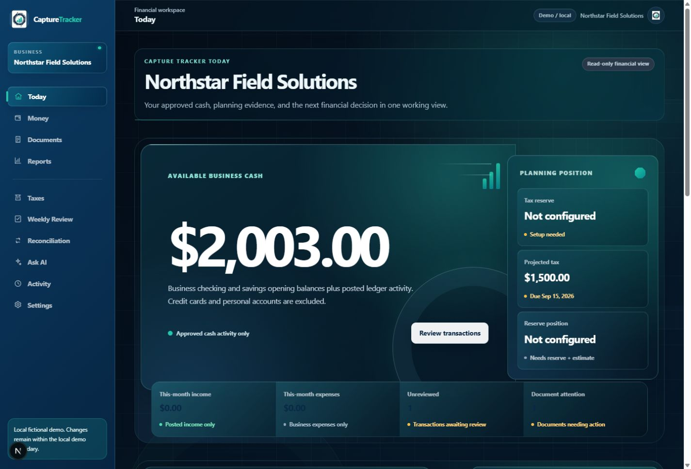
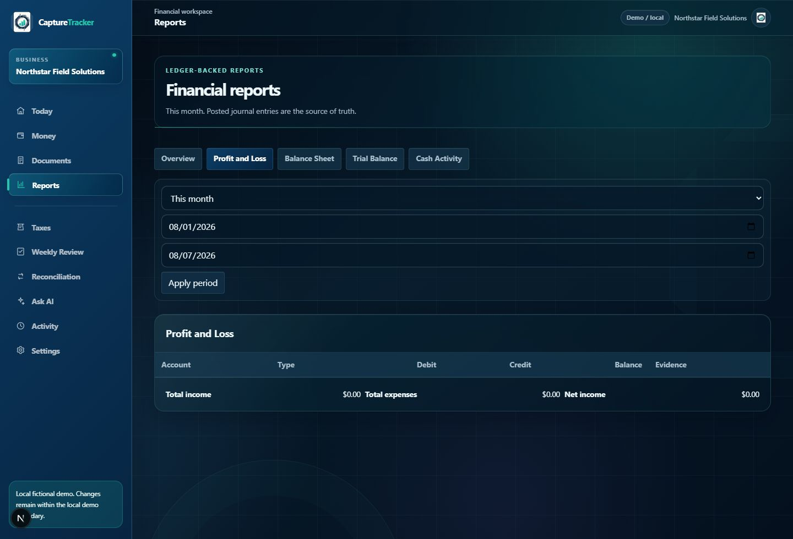

# Capture Tracker Product Manual

> **Current product note:** Money imports bank and credit-card CSV exports through **Import transactions**; imports are previewed and duplicate-safe, and bank evidence does not post accounting automatically. **Taxes → Owner money** distinguishes salary, distributions, reimbursements, contributions, and shareholder loans. Payroll results support bank-evidence review and an immutable owner-confirmed reversal.

**SPENDING TRACKED. BUSINESS GROWN.**

Private-pilot client guide · V1.0.0 · Documented source: `78dbb0c37991b1dbf23706bc906687eb6b24b574`

> **Private-pilot boundary.** Capture Tracker organizes recorded financial facts. It is not a CPA, does not file taxes or send payments, does not run payroll, invoice, manage inventory, or offer public self-service onboarding. Uploaded PDF, JPEG, and PNG files stay private and are security-scanned before they become available in Capture Tracker.

## Start here

Use the private workspace URL supplied by your owner. Sign in with your existing email and password. In an initialized production workspace, **Create account** is intentionally unavailable; ask the workspace owner to arrange access. The one-time first-owner setup closes automatically after the workspace is initialized. There is no self-service password-reset flow today—contact the workspace owner if you cannot sign in. Sign out from the workspace when you finish on a shared device.

## Navigation

Desktop navigation lists **Today, Money, Documents, Reports, Taxes, Weekly Review, Reconciliation, Activity, Settings**. On phones, the primary bar is **Today, Money, Documents, Reports, More**; More contains **Taxes, Weekly Review, Reconciliation, Activity, Settings**.

## Today — the decision briefing

Today is a read-only summary, not a second ledger. Start with Available Business Cash, planning signals for tax reserve and projected tax, current-period income and business expenses, unreviewed transactions, document attention, Weekly Review, and recent activity. Follow its links to make the underlying review or correction; Today never moves money or changes accounting.

*Local fictional demo capture. The business name, amounts, and activity are repository-provided synthetic data, not production information.*

## Money — record and review financial activity

Money is where transactions are entered, classified, searched, filtered, and reviewed. Use **Add transaction** to choose the financial account, date, description, amount, intent (income, expense, contribution, distribution, or mixed activity), category, and optional notes. A saved transaction creates a posted balanced journal entry. Business expenses affect business reporting; owner distributions are equity movements, not deductible expenses. Mixed transactions require a deliberate split whose total must equal the parent amount.

Use the transaction list to filter by review status, intent, or account and to open a transaction. Posted accounting is preserved: fix a mistake with the supported correction/reversal or replacement workflow rather than erasing history. A reversal preserves the original event and avoids a duplicate economic effect.

## Documents — supporting evidence

Documents holds private, business-scoped evidence. Upload **PDF, JPEG, or PNG** files only, up to **10 MiB**. Mobile browsers can offer **Take photo** with the rear camera. Camera photos are normalized on your device before upload to keep a readable receipt smaller; PDF files are unchanged. Review the preview, then upload; duplicate detection is based on file content.

> **Security scan.** After upload, the document remains private and unavailable while it is queued and scanned. The status refreshes automatically. Only a **Ready** document that passed the security scan can be opened, used for extraction/matching, or treated as document evidence. A scan failure leaves it unavailable; a rejected file cannot be used. Do not retry an identical rejected file under another name.

Once a document is Ready, the workspace shows validation, extraction, match, and link states. Suggestions and extracted values require review and never alter accounting automatically. Open a document to review protected metadata, extraction candidates, transaction links, and available actions. Remove is available only where the document has no protected accounting relationship; removal revokes access immediately.

## Reports — complete totals, readable detail

Choose a reporting period, then view Profit and Loss, Balance Sheet, Trial Balance, or Cash Activity. Report totals use complete database-backed accounting data. Supporting detail can be paginated for readability; pagination never makes totals partial.

- **Profit and Loss:** business income and business expenses for the selected period.
- **Balance Sheet:** assets, liabilities, and equity at the reporting date.
- **Trial Balance:** debit and credit balances; total debits and credits should match.
- **Cash Activity:** opening cash, money in, money out, net change, and ending cash.

Use **Export CSV** for the selected period when available. Exports are suitable for spreadsheets and protect against formula-like cell content. A large export may be safely refused rather than returned partially. The owner can also use **Download CPA package** for a ZIP of accounting schedules and a PDF index; it contains no private document bytes or storage links.

## Taxes — planning facts, not filing

Taxes presents the current tax year and quarter, ledger business income, salary expense, owner distributions, recorded estimated-tax payments, payroll facts, projected obligation, quarterly estimate remaining, reserve status, and missing inputs. Open estimate history to review an estimate and recorded payments made elsewhere; use Payroll summary and Owner compensation for factual review of wages, payroll taxes, and distributions. Payroll bank evidence remains unresolved when it is missing, partial, or different. To correct a processed payroll result, use the owner-confirmed reversal control; it posts an opposite linked journal and preserves the original record. Capture Tracker does **not** file returns, submit tax payments, process payroll, determine an IRS-approved salary, or replace a CPA.

## Weekly Review and Reconciliation

Weekly Review groups unresolved work into Transactions, Documents, Reconciliation, and Taxes. Start the week, work each linked record, then complete the review with an optional note. Completion records acknowledgement and history; it does not hide unresolved problems.

Reconciliation compares a financial account’s statement-ending balance with the cleared book balance. Review statement activity and candidate matches, approve or reject only a safe match, leave uncertain items unresolved, save the selection, and finalize only at an exact $0.00 difference. Matching does not create another transaction or journal effect. A completed reconciliation is preserved as evidence.

## Activity and Settings

Activity is the read-only, business-scoped history of transactions, corrections and reversals, documents, reconciliation, tax-payment records, Weekly Review, settings, exports, and relevant timestamps. Use filters and record links to investigate what happened.

Settings currently supports default report period, Weekly Review day (0–6), and document-retention target (12–120 months). Save after valid values are entered. Settings changes appear in Activity; if a concurrent update wins, refresh before saving again.

## Practical workflows

**Business purchase:** Money → Add expense → choose category → Documents → take/upload receipt → review and link → Reports.

**Business income:** Money → Add income → save → Reports.

**Receipt photo:** Documents → Take photo → permit the camera → review preview → upload → wait for **Security scan pending** to refresh to **Ready** → Open or link to the transaction.

**Fix or reverse a transaction:** Open the transaction → choose the supported correction or reversal → confirm the explanatory history and replacement record where applicable.

**Prepare for a CPA:** complete Weekly Review, resolve or note document attention, inspect Reports and Taxes, download the CPA package or export needed CSV, and provide unresolved questions separately.

## Mobile browser access

Open the production URL supplied by the owner in Safari or Chrome. On iPhone Safari, use Share → **Add to Home Screen**; on Android Chrome, use the menu → **Add to Home screen**. This creates a browser shortcut, not an App Store or Play Store app, and it does not promise offline operation. Allow camera permission only when photographing a trusted receipt. Confirm you are on the production URL before entering business data; staging and local demo environments are for fictional data only.

## Troubleshooting

| Situation | Safe action |
| --- | --- |
| Cannot sign in / session expired | Re-enter the supplied URL and credentials; contact the workspace owner if it persists. |
| Create account is absent | The private workspace is initialized; request owner-managed access. |
| Validation or duplicate submission | Correct highlighted values; wait for the first save to finish and refresh before retrying. |
| Security scan pending | Keep the page open briefly; status refreshes automatically. If it remains pending unusually long, contact the workspace owner rather than treating the file as usable. |
| File rejected, scan could not complete, or duplicate | Use PDF/JPEG/PNG under 10 MiB; do not re-upload an identical rejected or duplicate file. A failed scan remains private and unavailable. |
| Camera does not open | Allow browser camera permission, use HTTPS, or select an existing trusted file. |
| Document will not open | Confirm you are signed in and the document is active; contact support if protected access still fails. |
| Review task remains | Fix the linked record; completing Weekly Review alone does not clear it. |
| Reconciliation will not finalize | Resolve selection/matches until difference is exactly $0.00. |
| Report has no activity / CSV is refused | Check the period; large exports may be refused safely. |
| Settings conflict or phone layout issue | Refresh, then retry; update the browser or use its normal zoom. |

## Security, privacy, and glossary

The workspace is private and authenticated. Passwords are not displayed in the product. Data and documents are scoped to the business. New documents are quarantined and ClamAV-scanned privately before ACTIVE + CLEAN-only protected access; signed document access rechecks the current state. Accounting history uses corrections/reversals instead of destructive editing. Operational backups are encrypted; use normal sign-out practice on shared devices.

**Available Business Cash** is approved business cash, excluding personal accounts and credit cards. **Income** is business money received; a **Business Expense** is a business cost. An **Owner Contribution** adds owner equity; an **Owner Distribution** removes owner equity. A **Mixed Transaction** contains deliberate business/personal treatment. A **Category** classifies activity. A **Posted Transaction** has a balanced **Journal Entry**, where **Debit** and **Credit** totals match. A **Correction**, **Reversal**, or **Replacement Transaction** preserves history while fixing a mistake. A **Document** is evidence; a **Document Match** is a reviewed suggested relationship. **Weekly Review** is the grouped attention checklist. **Reconciliation** compares book and **Statement Activity**. A **Tax Estimate** is planning information. **Salary** and **Distribution** are distinct factual records. **Profit and Loss**, **Balance Sheet**, **Trial Balance**, and **Cash Activity** are the reports above. **Activity History** is the immutable record of material workspace events.

## Screenshot provenance

All `local-demo-*` images are captured from the repository’s built-in local fictional demo; no production or staging session, credential, client data, object key, or internal identifier was used. `public-production-*` images are unauthenticated public pages only.
